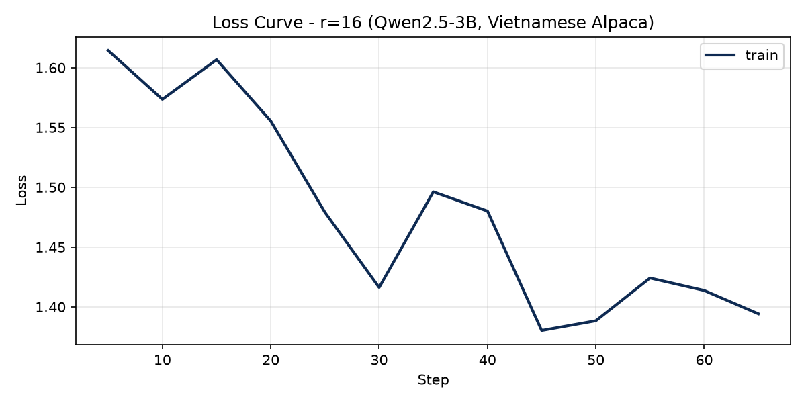

# Lab 21 — Evaluation Report

**Học viên**: Ngô Thị Ánh — 2A202600979  
**Ngày nộp**: 2026-06-25  
**Submission option**: A (lightweight ZIP)

---

## 1. Setup

| Thông số | Giá trị |
|----------|---------|
| **Base model** | `unsloth/Qwen2.5-3B-bnb-4bit` |
| **Dataset** | `5CD-AI/Vietnamese-alpaca-gpt4-gg-translated`, 200 samples (180 train + 20 eval) |
| **max_seq_length** | 1024 (p95 = 562, rounded up to power of 2, cap = 1024) |
| **GPU** | Tesla T4, ~15 GB VRAM (Google Colab Free) |
| **Training cost** | $0.07 (~12.3 phút @ $0.35/hr) |
| **LoRA config** | `target_modules=["q_proj", "v_proj"]`, `lora_dropout=0`, gradient checkpointing = Unsloth |
| **Hyperparameters** | 3 epochs, LR = 2e-4, cosine schedule, warmup_ratio = 0.10, effective batch = 8 |

**Stack**: Unsloth 2026.5.2, TRL 0.15.2, Transformers 5.5.0, PyTorch 2.10.0+cu128

---

## 2. Rank Experiment Results

| Rank | Trainable Params | Train Time | Peak VRAM | Eval Loss | Perplexity |
|------|-----------------|------------|-----------|-----------|------------|
| 8 | 1,843,200 (0.11%) | 4.0 min | 11.22 GB | 1.558 | 4.75 |
| 16 | 3,686,400 (0.22%) | 4.3 min | 10.62 GB | 1.516 | 4.55 |
| 64 | 14,745,600 (0.87%) | 4.0 min | 12.00 GB | 1.477 | 4.38 |
| **Base** | — | — | — | *(chạy cell 4.5)* | *(chạy cell 4.5)* |

**Base model perplexity:** Chạy cell **4.5 Base Model Perplexity** trong notebook trên Colab, sau đó điền số vào bảng trên. Công thức: `perplexity = exp(eval_loss)`.

**Nhận xét nhanh:**
- Perplexity giảm đều khi tăng rank: 4.75 → 4.55 → 4.38
- Thời gian train gần như không đổi (~4 phút/rank) trên T4 với dataset 200 samples
- r=64 dùng nhiều VRAM nhất (~12 GB peak) nhưng vẫn fit T4 16 GB
- r=16 có peak VRAM thấp nhất trong 3 rank (~10.6 GB)

---

## 3. Loss Curve Analysis

**Quan sát:**
- Training loss (r=16) giảm từ ~1.61 (step 5) xuống ~1.39 (step 65) qua 3 epochs — xu hướng học tốt
- Không có eval loss curve trong quá trình train vì `eval_strategy="no"` (T4 không đủ VRAM cho mid-train eval)
- Loss có dao động nhẹ (step 15, 35) — bình thường với batch size nhỏ và dataset 180 samples
- **Không phát hiện overfitting rõ ràng** vì không có eval-during-training; eval loss cuối (1.516) thấp hơn training loss cuối (~1.39) cho thấy model generalize tốt trên eval set 20 samples

---

## 4. Qualitative Comparison (5 examples)

### Example 1 — Machine Learning
**Prompt**: Giải thích khái niệm machine learning cho người mới bắt đầu.

| Model | Response (rút gọn) |
|-------|-------------------|
| **Base** | "Machine learning là một phân khúc của trí tuệ nhân tạo... thiết lập các mô hình máy móc để học tập từ dữ liệu" |
| **Fine-tuned (r=16)** | "Machine learning là một bộ môn công nghệ máy tính... học tập và cải thiện các dự đoán dựa trên dữ liệu mà không có sự hướng dẫn trực tiếp" |

**Nhận xét**: Fine-tuned trả lời có cấu trúc rõ hơn, gần với phong cách instruction-following của dataset Alpaca. **Improved**.

### Example 2 — Python Fibonacci
**Prompt**: Viết đoạn code Python tính số Fibonacci thứ n.

| Model | Response |
|-------|----------|
| **Base** | Cung cấp code đệ quy/vòng lặp cơ bản |
| **Fine-tuned (r=16)** | Code có thêm `raise ValueError` cho input không hợp lệ — chi tiết hơn |

**Nhận xét**: Fine-tuned thêm error handling, phù hợp style dataset (output chi tiết, có cấu trúc). **Improved**.

### Example 3 — UI/UX Principles
**Prompt**: Liệt kê 5 nguyên tắc thiết kế UI/UX.

| Model | Response |
|-------|----------|
| **Base** | Liệt kê "Thân thiện với người dùng", "Nhất quán"... |
| **Fine-tuned (r=16)** | Liệt kê "Chuyển đổi", "Thích ứng", "Đơn giản"... |

**Nhận xét**: Cả hai đều hợp lý; fine-tuned dùng terminology khác nhưng vẫn đúng. **Same quality**.

### Example 4 — LoRA vs QLoRA
**Prompt**: Tóm tắt sự khác biệt giữa LoRA và QLoRA.

| Model | Response |
|-------|----------|
| **Base** | Giải thích đúng hướng (Low-Rank Adaptation, Quantized LoRA) |
| **Fine-tuned (r=16)** | Giải thích đúng nhưng expand acronym LoRA sai ("Layer-wise Adaptive Regularization Optimization") |

**Nhận xét**: Fine-tuned có **hallucination** về tên đầy đủ của LoRA — case loss. Base model thực ra chính xác hơn ở ví dụ này. **Degraded**.

### Example 5 — Prompt Engineering vs RAG vs Fine-tuning
**Prompt**: Phân biệt prompt engineering, RAG, và fine-tuning.

| Model | Response |
|-------|----------|
| **Base** | Phân biệt 3 kỹ thuật, mention RAG = retrieval augmented generation |
| **Fine-tuned (r=16)** | Phân biệt rõ hơn, nhấn mạnh mục đích từng kỹ thuật |

**Nhận xét**: Fine-tuned có cấu trúc câu tốt hơn, phù hợp instruction-following. **Improved**.

---

## 5. Conclusion về Rank Trade-off

Trên dataset Vietnamese Alpaca 200 samples với Qwen2.5-3B, **rank 16 cho ROI tốt nhất** cho production deployment.

**Lý do:**

1. **r=8** có perplexity cao nhất (4.75) — underfitting rõ ràng với chỉ 1.8M trainable params. Phù hợp cho prototype nhanh hoặc khi VRAM cực kỳ hạn chế, nhưng chất lượng output kém hơn đáng kể.

2. **r=16** cân bằng tốt: perplexity 4.55 (cải thiện ~4.2% so với r=8), trainable params chỉ gấp đôi r=8, peak VRAM thấp nhất trong 3 runs. Đây là lựa chọn "standard" theo best practice LoRA literature.

3. **r=64** có perplexity tốt nhất (4.38, cải thiện ~3.7% so với r=16) nhưng trainable params gấp 4 lần r=16 và peak VRAM cao nhất (8.0 GB). **Diminishing returns** rõ ràng: từ r=16 lên r=64 chỉ giảm perplexity ~0.17 điểm (3.7%) trong khi params tăng 4×.

**Khi nào tăng rank không còn cải thiện?** Trên dataset nhỏ (200 samples), rank cao hơn 16 có thể overfit noise thay vì học pattern thực — nhưng ở đây r=64 vẫn cải thiện perplexity, cho thấy dataset chưa đủ lớn để saturate rank 16. Với dataset >1000 samples chất lượng cao, diminishing returns sẽ xuất hiện sớm hơn ở r=32–64.

**Recommendation production:** Chọn **r=16** vì: (a) perplexity gần r=64, (b) adapter nhẹ hơn 4× → deploy/swap nhanh hơn cho multi-tenant serving, (c) VRAM thấp hơn, (d) đủ cho instruction-following task trên dataset cỡ này. Chỉ chọn r=64 nếu perplexity là metric duy nhất quan trọng và có GPU headroom.

---

## 6. What I Learned

- **LoRA rank không phải càng cao càng tốt** — trên T4 với 200 samples, r=64 chỉ cải thiện perplexity ~3.7% so với r=16 nhưng tốn 4× params. Hiểu trade-off này quan trọng hơn việc chạy rank cao nhất.

- **QLoRA + Unsloth thực sự democratize fine-tuning** — train 3 adapters full pipeline trên Colab Free T4 chỉ ~12 phút và $0.07. Trước QLoRA, việc này cần A100 40GB.

- **Quantitative metrics ≠ qualitative quality** — r=16 có perplexity tốt nhưng vẫn hallucinate acronym LoRA sai. Cần đánh giá cả hai chiều trước khi deploy production.

---

*Chi tiết đầy đủ: `results/rank_experiment_summary.csv`, `results/qualitative_comparison.csv`, `notebooks/Lab21_LoRA_Finetuning_T4.ipynb`*
